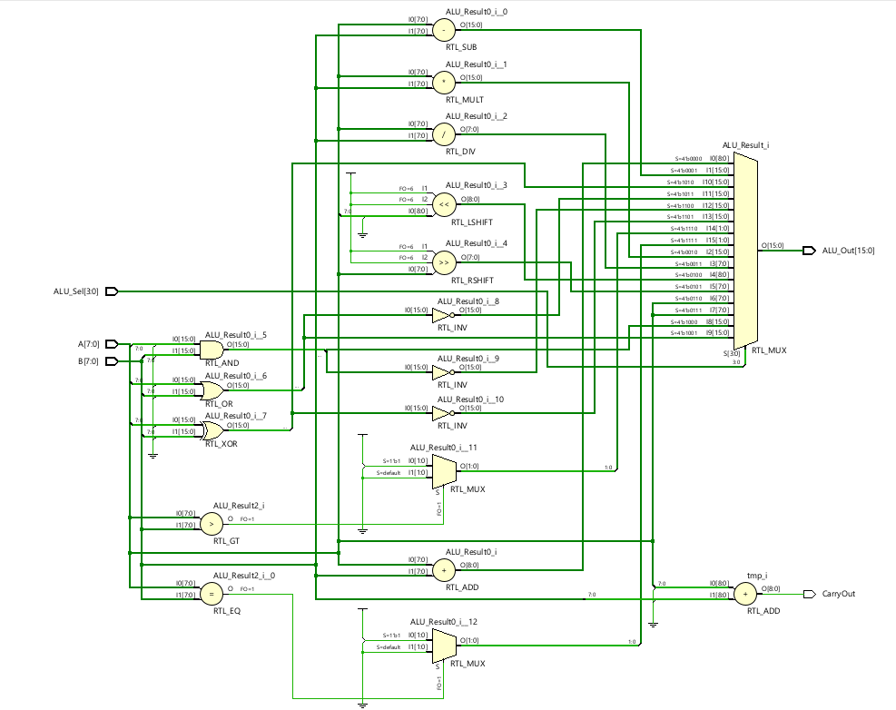
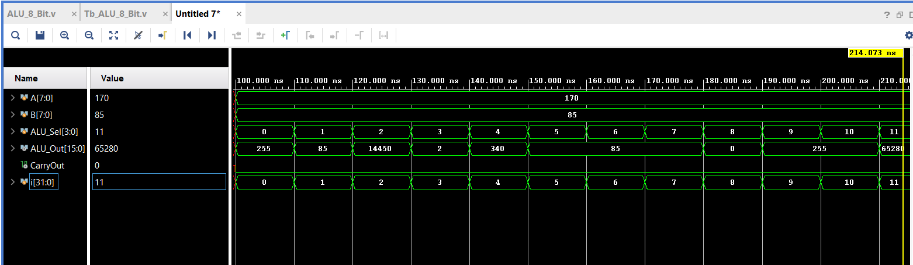

# ALU_8_BIT
Designed an 8-bit ALU using the vivado Xilinx software that performs all 8-bit Arithmetic and Logical
operations.

An 8-bit Arithmetic Logic Unit (ALU) is a digital circuit that performs arithmetic and logical operations
on 8-bit binary numbers. It is a fundamental component of many computer systems and processors.
Designing an 8-bit ALU in Verilog involves defining the input and output ports, as well as describing 
the behavior of the ALU using combinational logic.

Pre-requisites
--------------

- Verilog

## Explanation of the Design Process 
- Define the Input and Output Ports:

Inputs: Two 8-bit data inputs (A and B), a control signal (opcode), and an enable signal.
Outputs: An 8-bit result (ALU_result) and a set of status flags (carry, zero, overflow, etc.).

- Define the ALU Operation:

Determine the set of arithmetic and logical operations that the ALU should support, such as addition, subtraction, AND, OR, etc.
Assign unique opcodes to each operation, which will be used to control the behavior of the ALU.

- Implement the Combinational Logic:

Use if-else or case statements to describe the behavior of the ALU based on the opcode.
Write the logic for each operation, considering the input data and generating the appropriate result and status flags.
For example, for addition, you would use Verilog's "+" operator to add A and B and store the result in ALU_result.

- Handle Special Cases:

Handle carry-in and carry-out for addition and subtraction operations.
Implement overflow detection for signed arithmetic operations.
Determine the zero flag based on the result of the operation.

- Test and Verify:

Write testbench to verify the correctness of the ALU design.
Simulate different input combinations and compare the expected outputs with the actual outputs.

- Synthesize and Implement:

After verifying the design, you can synthesize the Verilog code to generate a gate-level netlist.
Use a synthesis tool like Yosys, Synopsys Design Compiler, or Xilinx Vivado to convert the Verilog code into hardware.
It's important to note that the actual implementation details and complexity of the ALU may vary based on the desired operations and features. This explanation provides a high-level overview of the design process. Further implementation details, such as the specific arithmetic algorithms and logic equations, will depend on the desired behavior and performance requirements of the ALU.

## Demo

## Features

- Addition
- Subtraction
- Multiplication
- Division
- Logical shift left
- Logical shift right
- Rotate left
- Rotate right
- Logical AND
- Logical OR
- Logical XOR
- Logical NOR
- Logical NAND
- Logical XNOR
- Greater comparison
- Equal comparison 

## Results

## Authors

- [@hemu33662](https://github.com/hemu33662)
